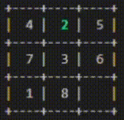

# N-puzzle
## Chart
A site as been created to see charts in `docs` folder.  
Launch the site with ```python3 data.py``` and visit http://localhost:8000   
or simply visit https://glegendr.github.io/N-puzzle. 
## Dependencies
The only dependencies you need are haskell and stack.  
To get them, check https://www.haskell.org/platform/ 
## Project
To start the project use:  
``` git clone https://github.com/glegendr/N-puzzle.git; cd N-puzzle; sh compile.sh ```  
You will get a binary call `N-puzzle`
## Flags
### All Flags
```./N-puzzle <flags>```   
If you got multiple time the same flag, only the first one will be use

|Short|Long|Value|Description|Mandatory|
|:-:|:-:|:-:|:-:|:-:|
|-m|--map|map's path|Map to solve|✔️|
|-r|--result|map's path|Result map||
|-f|--function|function name|Heuristic function apply||
|-a|--algorithm|algorithm name|Algorithm function apply||
|-v|--visual|visual flag|Print N-puzzle's steps||
|-i|--inverse|moves|Reverse the process||
|-g|--generate||Launch puzzle generator|
|-b|--benchmark||Launch benchmarks||
|-h|--help||Display helper||
### Map Flag
```./N-puzzle -m "pathToMyMap"``` or ```./N-puzzle -m="pathToMyMap"```  
This mandatory flag allow you to choose your incomming map.  
A valid map look like:   
``` txt
3
1 2 3
4 5 6
7 8 0
```
Your map must have:  
- a size greater than 2 at the top at the file
- the same height and width
- all numbers between 0 and (size^2 - 1) included

Your map can have:
- commentary. They start with `#` and finish at the end of the line
- multiple spaces between number / commentary

Thanks to [@Kerollmops](https://github.com/Kerollmops) we provided some default map `test-files/valids/`
### Result Flag
```./N-puzzle -r "pathToMyMap"``` or ```./N-puzzle -r="pathToMyMap"```
This flag allow you to choose your result map.  
The map must be valid (same constraints as [Map Flag](#map-Flag)) and own the same size as incomming map. 
If the flag is not provided, a snail map will be readed that look like:
``` txt
3
1 2 3
8 0 4
7 6 5
```
The default map is up to 6. If you are solving map larger than 6, you must provide a result map.  
We provided some default map `MapSolved/`
### Function Flag
```./N-puzzle -f "functionName"``` or ```./N-puzzle -f="functionName"```   
The differents heuristic functions are:

|Name|Value|Description|
|:-:|:-:|:-:|
|manhattan||The distance between all titles of current map and result map using the Taxicab geometry|
|wManhattan|weight|Same as manhattan, but weighted by `weight`|
|euclidean||The distance between all titles of current map and result map using the Euclidean distance|
|wEuclidean|weight|Same as euclidean, but weighted by `weight`|
|dijkstra||This function always return 1. This allow dijstra to check every branch|

To give a weight to a function, use `->` like `-f "wManhattan->3"`.  
This example will use `manhattan` and weight it by 3
### Algorithm Flag
```./N-puzzle -a "algorithmName"``` or ```./N-puzzle -a="algorithmName"```    
The differents algorithms are:

|Name|Value|Description|
|:-:|:-:|:-:|
|aStar||Add the return of algorithm function to the cost|
|wAstar|weight|Same as aStar, but the return of the  heuristic function is weighted by `weight`|
|minimizedAStar||Inverse of aStar. This algo will always get the worst and longer result|
|multStar||Multiply the cost with the algorithm function|
|averageStar||Return the power of the average between the cost and the heuristic function|

To give a weight to an algorithm, use `->` like `-a "wAstar->3"`.  
This example will use `aStar` and weight it by 3
### Visual Flag
```./N-puzzle -v "visualValue"``` or ```./N-puzzle -v="visualValue"```    
The visual flag allow you to choose if you want to print solving's steps or not.  
He got 4 differents values:   
|Short|Long|Description|
|:-:|:-:|:-:|
|0|empty|Don't print any steps|
|1|partial|Only print the incoming map and return map|
|2|all|Print each steps|
|3|animated|Animate each steps|

Here is an example of an animated solution.   


If the flag is not provided, the `empty` flag is the default value
### Inverse Flag
```./N-puzzle -i MoveList``` or ```./N-puzzle -i=MoveList```     
This flag reverse the process, the program execute your moves and compare the final puzzle with the expected result.   
The start map is given by [Map Flag](#map-flag) and the result map by [Result Flag](#result-Flag).    
A list of move looks like `[Long,Long,Long]` or `shortshortshort` as:    
`[Down,Left,Left,Up,Up,Right]` is the same as `DLLUUR`.   
All the actions are listed here:   
|Short|Long|Description|
|:-:|:-:|:-:|
|L|Left||
|U|Up||
|R|Right||
|D|Down||
|N|None|Do nothing|

If no value is provided, launch interactiv mode.    
This mode wait user's move and apply it to your map.   
You also can give `help` to get help or `quit` to quit interactiv mode.   

If a given move is not recognized, he is replaced by `None` and will be skipped.   
You can give a [visual flag](#visual-flag) to display steps or not
### Generator Flag
#### All Generator's Flags
```./N-puzzle -g```    
This flag provide puzzle generator.   
The generator flag own his specifics flags as:

|Short|Long|Value|Description|
|:-:|:-:|:-:|:-:|
|-s|--size|size|Change puzzle size|
|-b|--bool|bool|Change puzzle's solvability|
|-o|--output|path|Change puzzle's output|
|-r|--result|map|Allow you to choose a puzzle with which the generated puzzle will work|
|-h|--help||Display helper|  

If you got multiple time the same generator's flag, only the first one will be use
#### Generator's Size Flag
```./N-puzzle -g -s size``` or ```./N-puzzle -g -s=size```    
This flag allow you choose the size of the generated puzzle.   
The size must be at leat 3.
#### Generator's Bool Flag
```./N-puzzle -g -b "Bool"``` or ```./N-puzzle -g -b="Bool"```    
This flag allow you to choose puzzle's solvability.    
He got 2 differents values:

|Short|Long|Description|
|:-:|:-:|:-:|
|0|False|The puzzle will be unsolvable with result map|
|1|True|The puzzle will be solvable with result map|

If the flag is not provided, the `True` flag is the default value
#### Generator's Output Flag
```./N-puzzle -g -o "path"``` or ```./N-puzzle -g -o="path"```   
This flag change the output file.   
If not provided, the puzzle is written in the terminal.
#### Generator's Result Flag
```./N-puzzle -g -r "map"``` or ```./N-puzzle -g -r="map"```
This flag allow you to choose a puzzle with which the generated puzzle will work or not, depending of [Generator's Bool Flag](#generators-Bool-Flag).     
As same as [Result Flag](#result-Flag), the map must be valid.    
### Benchmark Flag
#### All Benchmark's Flags
```./N-puzzle -b```   
This flag provide simple benchmarks and chart generating.
The benchmark flag own his specifics flags as:

|Short|Long|Value|Description|
|:-:|:-:|:-:|:-:|
|-v|--visual|visualValue|Generate site's chart|
|-r|--regenerate||Regenerate site's chart with default value|
|-h|--help||Display helper|  

If you got multiple time the same benchmark's flag, only the first one will be use
#### Benchmark's Visual Flag
```./N-puzzle -b -v "visualValue"``` or ```./N-puzzle -b -v="visualValue"```   
This flag allow you to generate site's chart.   
The visual values are the same as [Algorithm Flag](#algorithm-Flag).   
You can generate multiple chart separating all the algorithm with `+` delimiter `-v="dijkstra+wManhattan->4+euclidean"`   
If an algorithm is not in the base site, he will replace the `Temporary Value`.   
Theses change are only availables in `localhost`
#### Benchmark's Regenerate Flag
```./N-puzzle -b -r```   
This flag will regenerate all json used in the site.   
The `Temporay Value` will be replaced by a `Manhattan 99`
## Authors
[@lojesu](https://github.com/lojesu/).   
[@glegendr](https://github.com/glegendr/).  
## Specials Thanks
[@Kerollmops](https://github.com/Kerollmops) who gave `tests-files` folder and `Eddy Malou` gif.   
[@Many](https://github.com/LegendreM) for all theses advices.   
